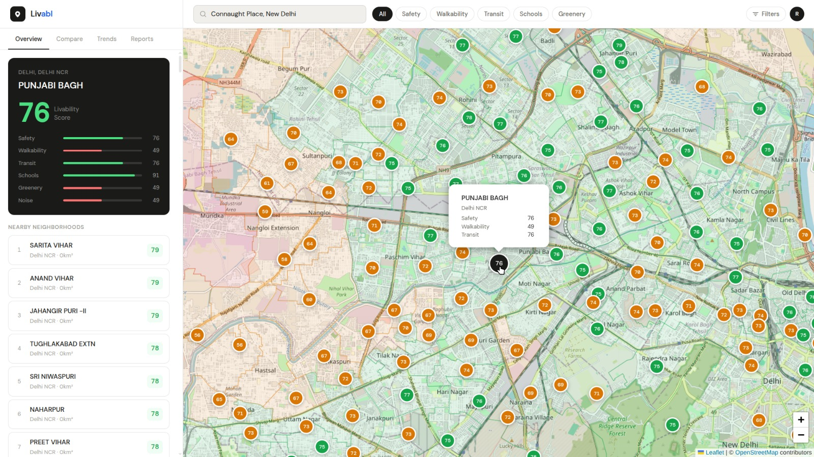

<div align="center">

# Livabl

**A Data-Driven Quality of Life Index for Smarter Home Decisions**

[](LICENSE)
[](https://www.openstreetmap.org)
[](https://react.dev)
[](https://fastapi.tiangolo.com)
[](https://fossunited.org)

Livabl is an open-source platform that aggregates public urban datasets to generate a **0–100 Quality of Life score** for every ward in Delhi NCR. It helps renters, homebuyers, researchers, and urban planners make informed decisions through comparable locality insights and an interactive map.

</div>

---

## The Problem

Housing decisions are often made with incomplete or biased information.

- Property listings only emphasize positives
- Short visits don't reveal long-term livability issues
- Public data on air quality, infrastructure, and civic issues is scattered across multiple portals with no unified view

As a result, people rely on price, intuition, and word-of-mouth rather than measurable quality-of-life indicators. **Delhi NCR alone has 11 million+ residents making housing decisions without reliable livability data.**

---

## The Solution

Livabl unifies multiple public datasets into a **standardized locality score (0–100)** and visualizes it on an interactive OpenStreetMap-powered dashboard.

The platform transforms complex urban data into simple, actionable insights through:

- Interactive ward-level map with color-coded livability zones
- Per-ward score breakdown for key metrics (hospital, school, pollution)
- Ranked neighborhood list with real-time filtering
- Side-by-side locality comparison in the sidebar

---

## Live Demo

> Dashboard running locally — see Getting Started below.



---

## Quality Score Metrics

Livabl computes a **0–100 livability score** with metric breakdowns currently exposed as:

| Metric | Description | Data Source |
|--------|-------------|-------------|
| 🏥 Hospital Score | Healthcare accessibility proxy | OpenStreetMap + processed ward data |
| 🏫 School Score | Education accessibility proxy | OpenStreetMap + processed ward data |
| 🌫️ Pollution Score | Environmental pressure proxy | AQI/processed ward data |

The frontend shows the combined livability score and these per-ward metric components.

---

## How the Scoring Works

```
Raw public datasets
        ↓
Data ingestion & cleaning (Python)
        ↓
Normalize metrics → 0-100 scale
        ↓
Weighted aggregation per ward
        ↓
Quality Score generated for all 290 Delhi wards
        ↓
Served via FastAPI → React dashboard
```

---

## Tech Stack

### Frontend
- **React + TypeScript** — component-based UI
- **Vite** — fast dev server and build tool
- **Leaflet.js** — interactive map rendering
- **OpenStreetMap** — free, open-source map tiles and ward boundary data

### Backend
- **Python + FastAPI** — REST API and data processing
- **GeoJSON** — ward boundary and score data format
- **uv** — fast Python package manager

### Data & Mapping
- **OpenStreetMap** — ward boundaries via Overpass API
- **290 Delhi NCR wards** with real livability scores
- Open environmental datasets (AQI, hospitals, schools)

---

## Project Structure

```
Livabl/
├── frontend/                  # React + TypeScript dashboard
│   ├── src/
│   │   ├── api/               # Backend API layer
│   │   │   ├── wards.ts       # Real ward data loading
│   │   │   └── overpass.ts    # OSM boundary parser
│   │   ├── components/        # UI components
│   │   │   ├── Header.tsx     # Search + filter bar
│   │   │   ├── LiveMap.tsx    # Leaflet OSM map
│   │   │   ├── Sidebar.tsx    # Score cards + ward list
│   │   │   └── ScoreBar.tsx   # Animated score bars
│   │   ├── types/             # TypeScript definitions
│   │   └── utils.ts           # Score color helpers
│   └── public/
│       └── data/
│           └── wards_score.geojson   # 290 Delhi ward scores
│
├── backend/                   # Python scoring pipeline
│   ├── app/
│   │   ├── api/routes.py      # FastAPI endpoints
│   │   ├── data/
│   │   │   ├── ingestion.py   # GeoJSON loader
│   │   │   ├── processing.py  # Ward data transformer
│   │   │   └── schemas.py     # Pydantic data models
│   │   └── scoring/           # Score computation engine
|   |       ├── engine.py
|   |       └── metrics.py      
│   └── data/
│       ├── raw/               # Source GeoJSON files
│       └── processed/         # Scored ward data
│
└── docs/                      # Architecture and methodology
```

---

## Getting Started

### Prerequisites

- Python 3.10+
- Node.js 18+
- npm
- **uv** (Python package manager)

```bash
pip install uv
```

### Installation

```bash
# Clone the repository
git clone https://github.com/WalkingDead1407/Livabl.git
cd Livabl
```

#### Backend (FastAPI + uv)

```bash
cd backend

# Install/lock dependencies from pyproject.toml + uv.lock
uv sync --dev

# Run the API server
uv run python run.py
```

The API will be available at `http://127.0.0.1:8000`.
Quick health check:

```bash
curl http://127.0.0.1:8000/health
```

#### Frontend

```bash
cd frontend
npm install
npm run dev
```

Open `http://localhost:5173` in your browser.

#### Connecting Frontend to Backend

Create a `.env` file inside the `frontend/` folder:

```
VITE_API_URL=http://127.0.0.1:8000
```

The frontend will use the live backend when available.
If backend is down/unreachable, it automatically falls back to local GeoJSON data.

### Common Troubleshooting

If the UI is stuck on `Loading neighborhoods…`:

1. Confirm backend is running:
   ```bash
   cd backend
   uv run python run.py
   ```
2. Check API health:
   ```bash
   curl http://127.0.0.1:8000/health
   ```
3. Ensure frontend `.env` points to the same backend URL:
   ```text
   VITE_API_URL=http://127.0.0.1:8000
   ```

---

## Contributing

Contributions are welcome! This project is built for FossHack 2026.

1. Fork the repo
2. Create a feature branch (`git checkout -b feat/your-feature`)
3. Commit your changes (`git commit -m "feat: add your feature"`)
4. Push and open a pull request

Please open an issue before starting work on a large feature so we can coordinate.

---

## License

MIT License — see [LICENSE](LICENSE) for details.

---

<div align="center">

**Livabl — Turning urban data into clear decisions.**

Built with ❤️ for [FossHack 2026](https://fossunited.org) · Powered by [OpenStreetMap](https://www.openstreetmap.org)

</div>
